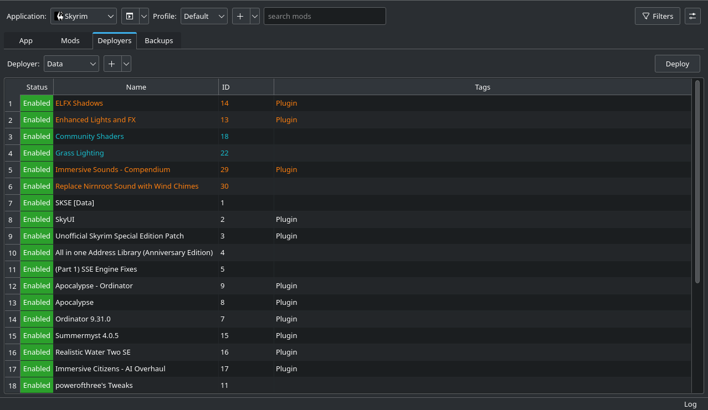

<h1 align="center">Limo </h1>

General purpose mod manager primarily developed for Linux with support for the [NexusMods](https://www.nexusmods.com/) API and [LOOT](https://loot.github.io/).

<p align="center">

</p>

## Features

- Multiple target directories per application
- Automatic adaptation of mod file names to prevent issues with case mismatches
- Auto-Tagging system for filtering
- FOMOD support
- Sort load order according to conflicts
- Import installed games from Steam
- Simple backup system
- LOOT integration:
    - Manage installed plugins
    - Automatically sort the load order
    - Check for issues with installed plugins
- NexusMods API support:
    - Check for mod updates
    - View description, changelogs and available files
    - Download mods through Limo
- OpenMW support:
    - Manages plugin and archive (.bsa) files
    - Supports LOOT
    
## How Limo works

There are two basic concepts you should know in order to understand how Limo works:
The *Staging Directory* and *Deployers*.

### Staging Directory
Whenever you install a mod, Limo does not change any file of the game you wish to mod immediately.
It instead stores all of the mod's files inside of the so called *Staging Directory*. This has the advantage of allowing
you to quickly change which mods should be enabled or win conflicts, should there be any.

### Deployers
In order to actually change the game you are trying to mod, there needs to be a mechanism which takes mods from the
*Staging Directory* and puts them into the game's directory. This is what *Deployers* do. Each *Deployer* manages
however many mods you assign to it and then links them into its *Target Directory*, which is the game's directory.
If there are any conflicts between mods, the mod lower in the *Deployer's* load order will win. Should any files in 
the *Target Directory* need to be overwritten, a backup is automatically created and restored when the mod is no
longer active.
    
***For a guide on how to use Limo, refer to the [wiki](https://github.com/limo-app/limo/wiki). This will help you even if you are not modding Skyrim.***

## Installation

### Flatpak

<a href='https://flathub.org/apps/io.github.limo_app.limo'>
    
</a>

### Arch Linux (via Arch User Repository)

<a href='https://aur.archlinux.org/packages/limo-git'>
	
</a>

### Build from source

####  Install the dependencies

 - [Qt5](https://doc.qt.io/qt-5/index.html)
 - [JsonCpp](https://github.com/open-source-parsers/jsoncpp)
 - [libarchive](https://github.com/libarchive/libarchive)
 - [pugixml](https://github.com/zeux/pugixml)
 - [OpenSSL](https://github.com/openssl/openssl)
 - [cpr](https://github.com/libcpr/cpr)
 - [libloot](https://github.com/loot/libloot)
 - (Optional, for tests) [Catch2](https://github.com/catchorg/Catch2)
 - (Optional, for docs) [doxygen](https://github.com/doxygen/doxygen)

On Debian based systems most dependencies, with the exception of cpr and libloot, can be installed with the following command:

```
sudo apt install \
		build-essential \
		cmake \
		git \
		libpugixml-dev \
		libjsoncpp-dev \
		libarchive-dev \
		pkg-config \
		libssl-dev \
		qtbase5-dev \
		qtchooser \
		qt5-qmake \
		qtbase5-dev-tools \
		libqt5svg5-dev \
		libboost-all-dev \
		libtbb-dev \
		cargo \
		cbindgen \
		catch2 \
		doxygen		
```

#### Clone this repository:

```
git clone https://github.com/limo-app/limo.git
cd limo
```

#### Build libunrar:

```
git clone https://github.com/aawc/unrar.git
cd unrar
make lib
cd ..
```

#### Build Limo:

```
mkdir build
cmake -DCMAKE_BUILD_TYPE=Release -S . -B build
cmake --build build
```
 
#### (Optional) Run the tests:

```
mkdir tests/build
cmake -DCMAKE_BUILD_TYPE=Release -S tests -B tests/build
cmake --build tests/build
tests/build/tests
```

#### (Optional) Build the documentation:

```
doxygen src/lmm_Doxyfile
```

## Usage Notes

### Flatpak version of Limo

From version 1.0.7 onwards, Limo supports specialized deployer and auto tag imports for Steam games. Currently it only supports Bethesda Games on Steam such as Skyrim, Skyrim SE, and Skyrim VR. ***Flatpak users who want to mod these games using Limo are automatically configured, but it is still recommended to read Limo's [Wiki](https://github.com/limo-app/limo/wiki) even if you are modding these games or not.***

#### To add tools and run the executable directly to Limo, use:

```
--directory="/tool/directory/" protontricks-launch --appid [steamappid i.e., 489830 for Skyrim SE] tool.exe
```

### AUR version of Limo

The Flatpak version of Limo is the officially supported version. There is no reason to use the AUR version of Limo, unless you like the instant download initialization (not the download speed) when downloading via mod manager on NexusMods, and early access to new features such as Reverse Deployer (unreleased as of 1.0.7). If you decided to use the AUR version, please don't spam and harass the main developer.

When you first use the AUR version of Limo, you'll notice that the UI is slightly different than the Flatpak version. ***Moreover, you'll notice that when importing games from steam such as Skyrim SE, the deployers are not pointing to the right directory, hence, one should read Limo's [Wiki](https://github.com/limo-app/limo/wiki) to properly configure them.*** 

#### Here's a quick glance of what deployer you should create and where it should point to.

| Name    |     Deployer Type      |                                                       Target Directory                                            | Deployment Method |
| ------- | ---------------------- | ----------------------------------------------------------------------------------------------------------------- | ----------------- |
| Bin     | Case Matching Deployer | ~/.local/share/Steam/steamapps/common/Skyrim Special Edition                                                      | Anything          |
| Data    | Case Matching Deployer | ~/.local/share/Steam/steamapps/common/Skyrim Special Edition/Data                                                 | Anything          |
| Plugins | Loot Deployer          | ~/.local/share/Steam/steamapps/compatdata/489830/pfx/drive_c/users/steamuser/AppData/Local/Skyrim Special Edition | Anything          |

For GOG users of these games, just find the game's folder. It should be almost similar, except the prefix folder.

#### To add tools and run the executable directly to AUR version Limo, use:

```
cd "/tool/directory"; protontricks-launch --appid [steamappid i.e., 489830 for SkyrimSE] tool.exe
```

## Contributing configurations

From version 1.0.7 onwards, Limo supports specialized deployer and auto tag imports for Steam games. Each configuration is stored in
a file named *<STEAM_APP_ID>.json* in the *steam_app_configs* directory of this repository. If you are using Limo to mod a Steam
game for which for no configuration file exists or if you want to improve an existing configuration, please consider open a Pull Request.

You can export your existing configuration by clicking on the *Export* button in the *App* tab. This will generate the file *exported_config.json*
in the app's staging directory. Before creating a Pull Request, rename this file to *<STEAM_APP_ID>.json*, e.g. *489830.json* for
Skyrim SE, and move it to the *steam_app_configs* directory.

**Note**: Deploy modes in this file will default to *hard link*, even if you are using sym links. When your configuration is imported by others,
sym links will automatically used instead if hard links do not work.

## Planned features
**BG3 Deployer**  
Similar to how the *LOOT Deployer* currently works, this will automatically add mods to the *modsettings.lsx* file in
order to better support modding Baldurs Gate 3.

**Bethesda base plugins**  
For Bethesda games like Skyrim, certain plugins are always loaded regardless of whether or not they are enabled
in the *LOOT Deployer*. This includes master plugins like *Skyrim.esm* and creation club content. These files should not
be listed by the *LOOT Deployer*.

**Mod grouping**  
Currently split mods and mod patches are treated as completely separate from each other. This
makes it hard to see which mods belong together and also makes it harder to uninstall them all at once. Grouping them
together in a tree view under the base mod will resolve this.

**Installation rules**  
Adds user defined rules that can be toggled during mod installation. These rules allow moving or
deleting files/ directories that match a certain pattern. This is intended to remove unnecessary files like screenshots and
to resolve issues where parts of a mod would have to be moved manually, like *Nemesis* files when using *Pandora* in
the case of Skyrim.

**Config file detection**  
Many mods and games allow tweaking some settings via config files (often ending in *.ini*).
This feature will add a new tab that lists all such files and offers a button to open them in the default editor. Rules for
detecting these files will be set by users, like those for auto tags.

**API support**  
Support for automatically checking for updates and downloading mods from modding websites that
provide this functionality like *Thunderstore* and *Gamebanana*.

**Deployers for other games**  
If a game requires more specialized actions, like the current *LOOT Deployer* for
Skyrim, in order to be modded, a deployer can be added if there is demand for it.
